<br>

# WellLogs.jl

## Introduction
This package is being designed among others to provide Petroleum Engineering tools in a modern programming language. This package is part of the project 7G which  proposes to make basic but powerful engineering software packages that cover the main topics of the Oil and Gas development phases which could be applied to any case study by suitable engineers.

There are five topics in which the project is going to be focused on:

<br>-Geoscience* (Current Package)
<br>-Reservoir
<br>-Production
<br>-Economics
<br>-Integration

<br> The package will always be in permanent development and open to suggestions to enhance the program. As the code has been written so far by a code enthusiastic Petroleum Engineer I hope to learn as much as possible to get better and usefull programs.

## WellLogs.jl Description
WellLogs.jl is package to visualize Oil And Gas Well logs in order to make interpretetion and petrophysics analysis via PyPlot plots.

<br> The visualization of logs is based on Tracks functions. Each log track is implemented through a single function that plot the desired data. For example, the Lithology Track is composed generally by GammaRay and Sp logs, so LithoTrack function can plot the GammaRay and SP logs with optional features like add Well tops (Formations or Units), Gr clean and Gr shale to Vshale estimations, etc...

The visualization of logs is customizable through the use of Subplots to show any track as well as the use [Interact.jl](https://github.com/JuliaGizmos/Interact.jl) to add interactivity, mainly depth limits.

## Tutorial

Load Packages required:
```julia
using Interact
using PyPlot
using CSV
using Colors
using DataFrames
using Statistics
using Query
using Interpolations
using Distributions
using WellLogs
```

The logs, perforations and Formation and Tops units, in this case, are stored in CSV files which are loaded:

```julia
Logs=CSV.read("~\\Logs.csv")
Fms=CSV.read("~\\FormationTops.csv")
Perfs=CSV.read("~\\Perforations.csv")
Units=CSV.read("~\\UnitsTops.csv")
```

Logs Example<br>

| WellId | Md | GammaRay  | Sp
| --- | --- | --- | --- |
| 1 | 0 | 123 | 345 |
| ... | ... | 678 | 987 |
| 2 | 6839 | 843 | 548|

```julia
@manipulate for from=9000, to=10180

    fig, axes=subplots(1,3,figsize=(10,5))
    withfig(fig,clear=false) do
        for ax in axes
            ax.cla()
        end
 subplot(131)        
 LithoTrack(Logs.Md,Logs.GammaRay,SponPot=Logs.SP,DepthFrom=from,DepthTo=to,WellUnit=Units[:,[:MdTop,:MdBottom]],UnitAlpha=0.5)       

  subplot(132)
 PoroTrack(Logs.Md,Logs.Density,Logs.NeutronSand,DepthFrom=from,DepthTo=to)

 subplot(133)        
 ResTrack(Logs.Md,Res=[Logs.ShallowRes Logs.MediumRes Logs.DeepRes],DepthFrom=from,DepthTo=to)
    end
end
```
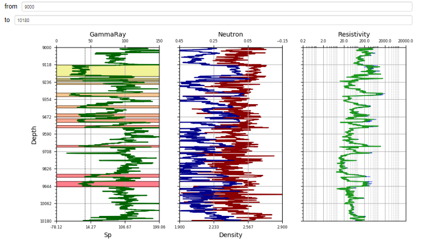<br>

### Petrophysics

To estimate basic Petrophysics calculations on the current DataFrame log, AddColPetro function add either all or specific columns of zeros to log DataFrame.

```julia
Logs=AddColPetro(Logs,All=true)
names(Logs)
25-element Array{Symbol,1}:
 :WellId     
 :Md         
 :Tvd        
 :Tvdss      
 :GammaRay   
 :SP         
 :NeutronSand
 :Density    
 :MicroRes   
 :ShallowRes
 :MediumRes  
 :DeepRes    
 :Sonic      
 :Caliper    
 :Pe         
 :Bit        
 :Dcor       
 :NeutronLime
 :Vsh        #(Added)
 :Phie       #(Added)
 :Sw         #(Added)
 :Perm       #(Added)
 :PayFlag    #(Added)
 :Kh         #(Added)
 :DenPhi     #(Added)
 ```

 Once the columns required are created, it is estimated the petrophysics calculation by PetroPhysics function

 ```julia
 Logs=PetroPhysics(Logs,9010,10172,Vsh=[19,73],DenPhi=[2.65,1],Phie=true,Sw=[0.62,2.15,2,0.8],Perm=["Gas","Timur"]);
 ```
|Parameter|Description
|---|---|
|DepthFrom,DepthTo;    |#range of depth to calculate Petrophysics
| Vsh                  | #If caculate Vshale   [GrSand, GrShale]
| DenPhi                |#If caculate Porosity from Density Log  [RhoMatrix, RhoFluid]
| Phie                  |#If caculate Efective Porosity. It is requiered Vsh, DenPhi, and Neutron
| Sw                    |#If caculate Water Saturation. It is requiered Phie and DeepRes and Archie Parameters[a,m,n,Rw]
| Perm                  |#If caculate Permeability).    Phie, Sw, Fluid, Author [Fluid, Author]
| PayFlag                |#If calculate PayFlag. It is requiered Vsh,Phie,Sw,Perm [VshCutoff,PhieCutOff,SwCutoff,KCutOff]
| Kh                     |#If requiered Flow Capacity percentage|

Then you can plot the results within an interactive plot:

```julia
@manipulate for from=9300, to=9344, grsand=20, grshale=100

fig, axes=subplots(1,5,figsize=(10,5))
    withfig(fig,clear=false) do
        for ax in axes
            ax.cla()
        end

subplot(151)        
 LithoTrack(Logs.Md,Logs.GammaRay,SponPot=Logs.SP,DepthFrom=from,DepthTo=to,
            WellUnit=Units[:,[:MdTop,:MdBottom]],GRSand=[grsand,from,to],GRShale=[grshale,from,to])
subplot(152)
 VshTrack(Logs.Md,Logs.Vsh,DepthFrom=from,DepthTo=to,PhiePlot=Logs.Phie)

subplot(153)
 PoroTrack(Logs.Md,Logs.Density,Logs.NeutronSand,DepthFrom=from,DepthTo=to)       

 subplot(154)        
ResTrack(Logs.Md,Res=[Logs.ShallowRes Logs.MediumRes Logs.DeepRes],DepthFrom=from,DepthTo=to)

  subplot(155)
SwTrack(Logs.Md,Logs.Sw,DepthFrom=from,DepthTo=to)       
    end
end
```
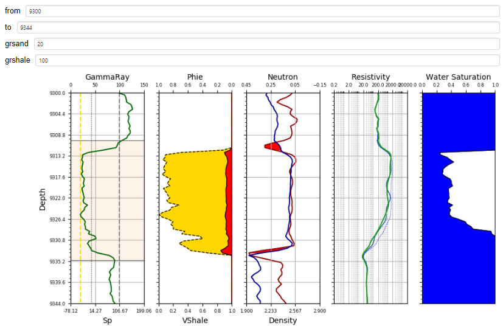<br>

## Other features

### Picket Plot  

A picket plot can be added by calling PickettPlot function

```julia
function PickettPlot(Rt,Phie,Rw;      #Must provide Rt, Phie and Rw
                    a=1,m=2,n=2,      #Default values for Archie equation
                    Sw=range(0.2,stop=1,length=5),  #Default Sw range to plot
                    WellName="-")

.....................
PickettPlot(LC1.DeepRes,LC1.Phie,0.8)
```
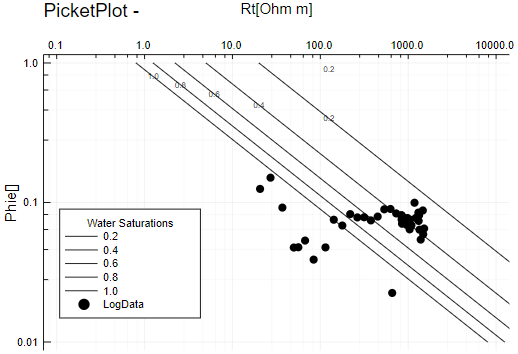<br>

### Distance between points

You can plot the distancew between points giving x, y and optionally z coordinates.

```Julia
xs=[20.,35.,3.]
ys=[45.,25.,25.]
n=["Point A","Point B","Point C"]

topdistance(xs,ys, Names=n, Show=2, title="All Distances Between Three Points", xlim=(0,50), ylim=(15, 60))
```
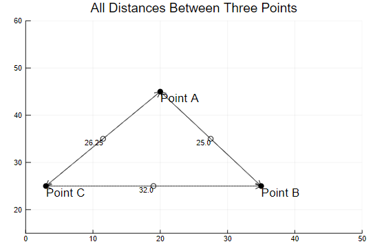<br>

You can choose only one point to see all distances with respect of it.  
For example, to plot distances with respect the second point ("Point B") just add ```Show=3```
```Julia
topdistance(xs,ys, Names=n, Show=2, title="All Distances Between Three Points", xlim=(0,50), ylim=(15, 60))
```
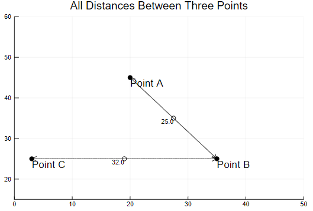<br>

### Spatial Interpolation to plot Coutour Maps  

You can make spatial interpolations and plot the results in a contour map using idwi (Inverse Distance Weight Interpolation)

```julia  
x=rand(collect(1.:50.),10)
y=rand(collect(1.:50.),10)
z=rand(collect(100.:500.),10)

idwi(x,y,z, title="Contour map by Inverse Weight Interpolation")
```
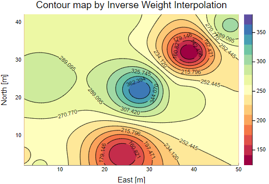<br>

You can modify the grids to interpolate as well as the exponent of the idwi method. Besides, you can combine the distance plot with a contour plot.

```julia
x=rand(collect(1.:30.),10)
y=rand(collect(1.:30.),10)
z=rand(collect(100.:500.),10)

xs=[5.,15.,20.]
ys=[10.,20.,27.]
n=["Point A","Point B","Point C"]

idwi(x,y,z, n=100, m=100, p=2,title="All Distances Between Three Points and Contour Map", seriescolor = :heat)
topdistance!(xs,ys, Names=n, Show=2)
```
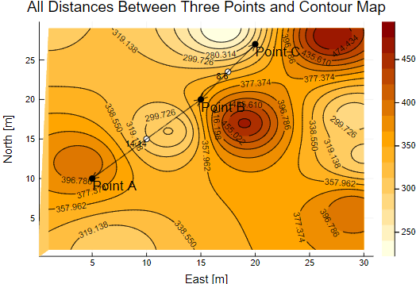<br>

### Volumetrics Estimations - Original Oil In Place & Original Gas In Place

You can perform Volumetrics Calulations both Deterministic and Probabilistic.  

From the Well Logs, you can estimate the probability distribution of certain property whose parameters can be used as input for volumetrics calculations.

For example

The Probability distribution of any variable can be estimate using ```fit``` function of Distrubition.jl Package.
```julia
PhieDistribution=fit(Normal,Logs.Phie.*1)
SwDistribution=fit(LogNormal,Logs.Sw.*1)
```
It also can be plotted

```julia
p1=prophist(Logs.Phie,Normal,seriescolor= :darkred, seriesalpha=:0.2, title="Porosity")
p2=prophist(Logs.Sw,LogNormal,seriescolor= :darkblue, seriesalpha=:0.2,title="Water Saturation")
p=Plots.plot(p1,p2, layout=(2,1))
```
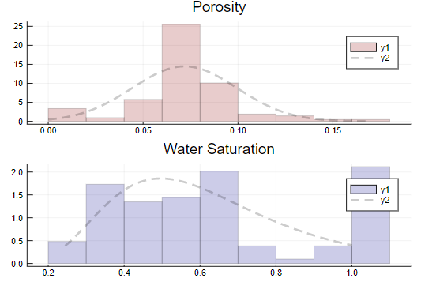<br>

Once you have the some distribution for your properties, you can estimate probabilistically volumetrics calculations with P10, P50 and P90 Percentiles.

```julia
OGIP(Area=458,Height=26.3, Pres=3940, Temp=180,z=0.99,PhiDist=PhieDistribution,SwDist=SwDistribution,DisHist=true)
```
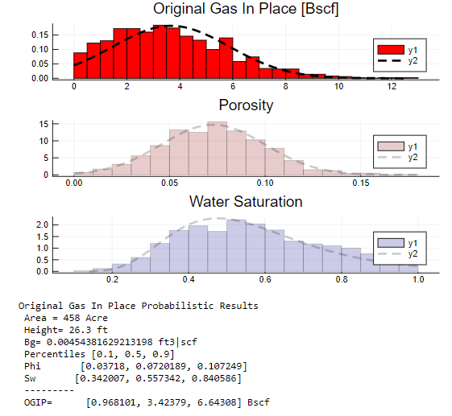<br>

```julia
OOIP(Area=458,Height=26.3, Bo=1.2 ,PhiDist=Normal(0.1,0.02),Sw=0.55, Perc=[0.2 0.6 0.8], DisHist=true)
```
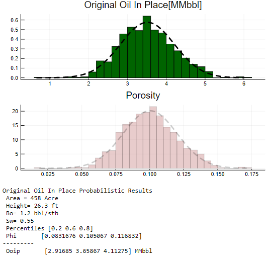<br>

Deterministic calculations can also be performed as well

```julia
OOIP(Area=458,Height=26.3, Bo=1.2 ,Phi=0.07,Sw=0.55)
```
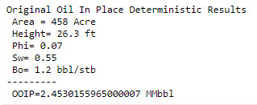<br>

```julia
OGIP(Area=500,Height=20, Bg=0.005812 ,Phi=0.18,Sw=0.2 )
```
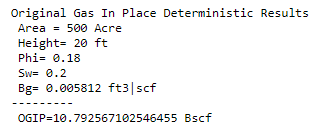<br>
